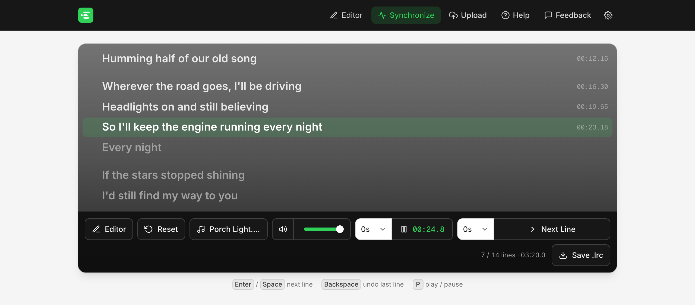
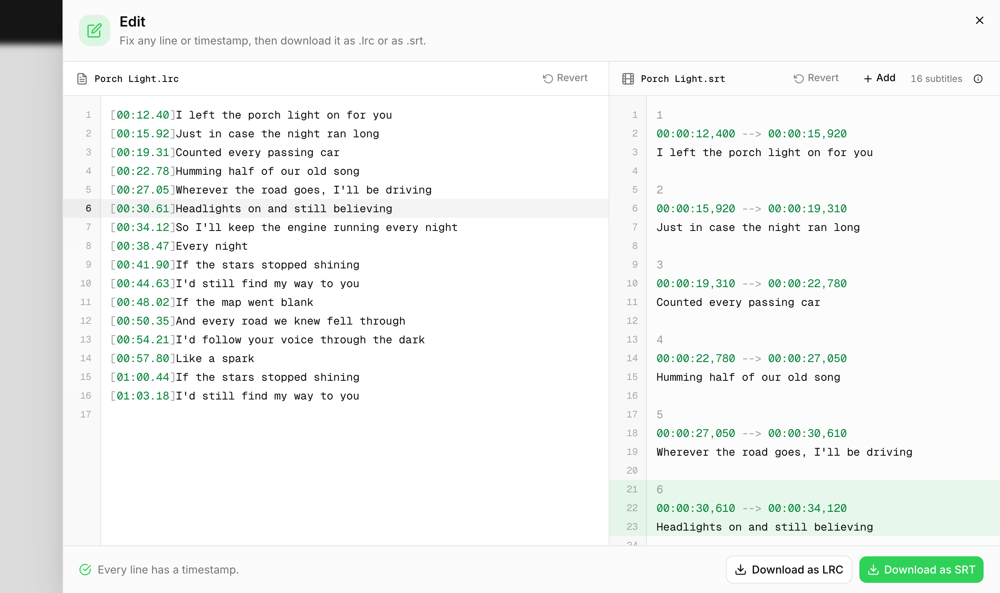
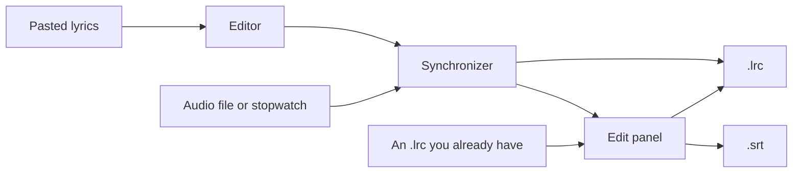

<p align="center">
  
</p>

<h1 align="center">LRC Generator</h1>

<p align="center">
  <strong>A browser-based LRC generator for synced lyrics.
</strong>
</p>

<p align="center">
  <a href="LICENSE">
    
  </a>
  <a href="https://github.com/alsonick/lrc.notnick.io">
    
  </a>
  <a href="https://lrc.notnick.io">
    
  </a>
</p>

<p align="center">
  <a href="https://lrc.notnick.io"><strong>Open the app</strong></a> &bull;
  <a href="#run-it-locally">Run it locally</a> &bull;
  <a href="https://lrc.notnick.io/privacy">Privacy</a> &bull;
  <a href="https://github.com/alsonick/lrc.notnick.io/issues/new">Suggestions</a>
</p>

---

LRC Generator makes synced lyric files. An `.lrc` is a plain text file with a
timestamp in front of every line, and it is what music players and karaoke
apps read to show lyrics in time with a song.

You paste the lyrics, play the track, and press a key as each line starts.
At the end you get the `.lrc`, and the same timings as `.srt` subtitles if you
want them.

<p align="center">
  <picture>
    <source media="(prefers-color-scheme: dark)" srcset=".github/synchronize-dark.png" />
    
  </picture>
</p>

## What you get

```
[00:12.40]I left the porch light on for you
[00:15.92]Just in case the night ran long
```

Keep that file next to the audio, with the same name, and most players pick
it up on their own. The same two lines as subtitles:

```
1
00:00:12,400 --> 00:00:15,920
I left the porch light on for you

2
00:00:15,920 --> 00:00:19,310
Just in case the night ran long
```

## Cleanup

Lyrics copied from Genius, or most other sites, arrive with section headers,
ad-libs in brackets and a few stray lines from the page. The editor's toolbar
gets rid of them:

- **Strip sections** removes `[Verse 1]`, `[Chorus]` and other headers.
- **Strip tags** removes `[mm:ss.xx]` time tags and metadata lines.
- **Strip ()** removes asides in parentheses, such as `(Let's go)`.
- **lowercase** and **UPPERCASE** change the case. **Original** puts it back.

Each of these shows a toast with an Undo button, so nothing is a one-way
trip. Pasting a file that is already timed works too. Its timestamps are
kept, and metadata lines such as `[ar: Artist]` are never stamped.

## Synchronize

Load the audio, press **START**, and hit `Enter` or `Space` every time a line
begins. That line gets the current time and the next one moves up.

A few things make this less fiddly than it sounds:

- No audio file? START runs a stopwatch for music playing elsewhere.
- A countdown of 3, 5 or 10 seconds beeps before playback starts.
- Press late? The dropdown beside **Next Line** shifts stamps earlier.
- Got one wrong? Pause and click its dot to redo from that line.
- Spotted a typo? Pause, click the line's text and fix it in place.

| Key | Action |
| --- | --- |
| `Enter`, `Space`, `↓`, `→` | Next line (or start / continue) |
| `Backspace`, `↑`, `←` | Undo the last line |
| `P` | Play / pause |

When every line is stamped, Next Line reads **Done**. Files are named after
the audio file, and blank lines, which show as spacing while you sync, are
left out of them.

## Fix it before you save it

Done asks one question: **Edit**, or **Cancel** to download the `.lrc` as it
is. Edit opens a panel with the `.lrc` on the left and the `.srt` it converts
to on the right. Both are plain editable text.

<p align="center">
  <picture>
    <source media="(prefers-color-scheme: dark)" srcset=".github/edit-dark.png" />
    
  </picture>
</p>

Lines with no timestamp, and timestamps that run backwards, are marked. The
footer says what is wrong with the one under your caret and walks you through
the rest. Put the caret on a line and its counterpart on the other side lights
up.

The subtitles follow the `.lrc` until you edit them by hand. After that they
are their own text: split one over two rows, change its times, or **Add** a
new one after the caret. **Revert** undoes your edits to the `.lrc`, and on
the subtitle side it rebuilds them from the `.lrc`. Hand edits to the
subtitles only exist in the panel, so closing it before you have downloaded
them asks first.

### How an .lrc becomes an .srt

- Each subtitle stays up until the next line starts.
- A timestamp on its own line, like `[01:02.00]`, ends the one before it
  early.
- The last subtitle runs until the song ends, or for five seconds without
  audio.
- The song's length is measured by decoding the audio, so it is exact.
- Lines without a timestamp are left out, and `[offset: …]` is applied.
- A line with several timestamps becomes one subtitle for each.

## Bring a file you already have

**Upload** in the header opens an existing `.lrc` straight in the Edit panel,
with no syncing first. Add the song's audio as well if you want the last
subtitle to run to the end.

Despite the name, nothing is uploaded. The file is read by your browser, and
it stands on its own: downloads are named after it, and the lyrics in the
editor are left alone.

## What leaves your browser

Your lyrics and your audio don't. Lyrics are held in memory, so reloading the
page gives you a blank editor, and the audio is played
and measured on your machine.

Two things are sent, both to a private Discord text channel:

- **Feedback**
- **Usage**

There are no cookies, no account and no third-party analytics. Read more here > [lrc.notnick.io/privacy](https://lrc.notnick.io/privacy).

## How it fits together



It is a Next.js 16 app (App Router) with React 19, TypeScript, Tailwind CSS 4
and shadcn/ui on Base UI. There is no database. The only server code is two
small routes that forward feedback and the usage record to Discord.

| Where | What |
| --- | --- |
| `src/lib/lyrics-store.ts` | The in-memory store the editor and synchronizer share |
| `src/hooks/use-clock.ts` | One clock for both audio playback and the stopwatch |
| `src/components/export/` | The Edit panel, its code editor and the Upload dialog |
| `src/lib/session-log.ts` | The usage record's fields and its message for Discord |
| `src/lib/audio.ts` | Measuring an audio file's real length by decoding it |
| `src/lib/lrc.ts` | Parsing lyrics, cleaning them up and writing the LRC |
| `src/lib/srt.ts` | Turning LRC into SRT and reading hand-edited subtitles |
| `src/app/api/` | The two routes that pass feedback and logs to Discord |

## Run it locally

You need [Node 20.9](https://nodejs.org) or newer and [pnpm](https://pnpm.io).

```bash
git clone https://github.com/alsonick/lrc.notnick.io
cd lrc.notnick.io
pnpm install
pnpm dev
```

Then open http://localhost:3000. `pnpm build` and `pnpm start` serve the
production build, and `pnpm lint` runs ESLint.

The app works without any configuration. Two optional Discord webhooks switch
on the parts that talk to a server. Copy `.env.example` to `.env.local` and
set whichever you want:

| Variable | What it does | Without it |
| --- | --- | --- |
| `DISCORD_WEBHOOK_URL` | Receives messages from the Feedback form | The form says feedback isn't set up |
| `LOGGING` | Receives the usage record | Nothing is logged anywhere |

Make a webhook in Discord under Server Settings > Integrations > Webhooks.
Use a different channel for each.

## Feedback

Bugs and ideas are welcome. [Open an issue](https://github.com/alsonick/lrc.notnick.io/issues/new),
or use the Feedback button in the app, which comes straight to me.


## License

[MIT](LICENSE).
